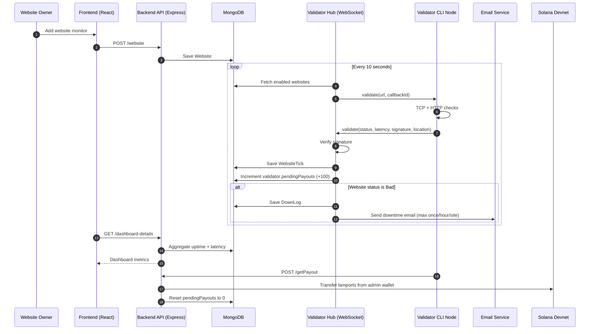

# AEGIS: Decentralized Website Monitoring Network

AEGIS is a decentralized uptime monitoring platform where independent validator nodes verify website availability, sign their results, and earn rewards for useful work.

The system combines:

- A React dashboard for website owners and validators
- An Express + MongoDB backend for orchestration and analytics
- A WebSocket validator hub for distributed checks
- Validator CLI clients that run checks from different network locations
- Solana-based reward payout settlement for validators

## Challenge Fit: DePIN Track

This project is built for the DePIN category of the challenge:

- **Economic system**: Validators are rewarded per validation event (`100` lamports per accepted check).
- **Coordination at scale**: Monitoring is distributed across multiple independent validator nodes rather than one centralized monitor.
- **Transparent outcomes**: Signed validation responses and persisted tick history make uptime claims auditable.
- **Public-good utility**: Reliable uptime data helps operators, users, and teams make faster operational decisions.

## Economic and Governance Design

This implementation maps directly to the challenge objective of redesigning value, power, and coordination:

- **Value distribution**: Rewards are tied to measurable work (successful validation responses), not centralized contracts.
- **Power distribution**: Monitoring authority is spread across independent validators rather than a single infrastructure operator.
- **Coordination layer**: The hub assigns jobs and validates signed responses, creating a verifiable work marketplace for uptime checks.
- **Governance-ready foundation**: Validator performance and historical tick quality can be extended into reputation, delegation, or slashing policies.

## Why This Project Is Useful

Traditional uptime monitors usually rely on single-vendor infrastructure. That creates blind spots and trust assumptions:

- A provider outage can hide your real uptime.
- Checks from one region can miss region-specific failures.
- Results are difficult to independently verify.

AEGIS improves this by:

- Running checks from decentralized validator nodes
- Verifying validator responses using cryptographic signatures
- Keeping historical status/latency data for analytics
- Incentivizing validators with measurable on-chain payouts

## Core Features

### For website owners

- Create and manage website monitors
- Enable/disable monitoring per site
- View uptime percentage and latency trend history
- Receive downtime email alerts with location data (rate-limited)
- Inspect recent downtime events and validator activity metrics

### For validators

- Register/sign in as a validator
- Run a validator client using CLI (`validator-cli` / `linux-cli`)
- Receive validation jobs over WebSocket
- Measure latency + availability and submit signed proofs
- Accumulate pending rewards and withdraw to Solana public key

### Platform-level

- Multi-validator distributed checks every 10 seconds
- Signature verification on validator responses
- Reward accounting with pending payout balance
- Solana transfer settlement via admin payout wallet

## Architecture

### Main services

1. **Frontend** (`frontend/`): React + Vite + Clerk auth + dashboard UI
2. **Backend API** (`backend/index.js`): Express endpoints for users, websites, validator auth, analytics, and payout
3. **Validator Hub** (`backend/hub/server.js`): WebSocket coordinator that dispatches checks and verifies responses
4. **Database** (`MongoDB`): Stores users, websites, ticks, validators, and down logs
5. **Validator CLI** (`validator-cli/`, `linux-cli/`): Worker clients that execute network checks and return signed results
6. **Solana Devnet**: Reward payout rail for validator withdrawals

## Workflow Diagram



## How It Works (Deep Dive)

### 1. Identity and onboarding

- Website owners authenticate through Clerk in frontend.
- Validators register through `/validator` with:
  - profile fields
  - payout public key
  - generated validator signing keypair
  - IP/location checks (`verifyIPLocation`) for basic integrity

### 2. Monitor creation

- Owner creates monitor from dashboard (`POST /website`).
- Each monitor stores URL, owner ID, and active/disabled state.

### 3. Validation dispatch loop

- Hub service runs a scheduler every 10 seconds.
- For each enabled website and connected validator:
  - Hub sends `validate` job with unique callback ID.
  - Validator performs network checks (TCP + HTTP/HEAD fallback).
  - Validator returns signed result with `Good`/`Bad`, latency, and location.

### 4. Verification and persistence

- Hub verifies response signature before accepting result.
- Valid results are stored as `WebsiteTick` records.
- If status is bad:
  - A `DownLog` record is stored.
  - An email alert is sent to owner (at most once/hour/site).

### 5. Incentive accounting

- On every accepted validation, hub increments validator `pendingPayouts` by `100` lamports.
- Validator dashboard displays payout accumulation and recent activity.

### 6. Settlement

- Validator requests payout (`POST /getPayout`).
- Backend creates Solana transfer from admin wallet to validator payout key.
- On success, `pendingPayouts` is reset to `0`.

## Data Model

| Entity | Purpose | Key fields |
|---|---|---|
| `User` | Website owner identity | `email`, `userId` |
| `Website` | Monitored target | `url`, `websiteName`, `userId`, `disabled`, `lastEmailSent` |
| `Validator` | Validator account + rewards | `publicKey`, `payoutPublicKey`, `location`, `pendingPayouts`, `password` |
| `WebsiteTick` | Single validation sample | `websiteId`, `validatorId`, `status`, `latency`, `createdAt` |
| `DownLog` | Downtime event feed | `websiteId`, `location`, `createdAt` |

## Uptime and Metrics Logic

- **Uptime** is computed as:

  `uptimePercentage = (goodTicks / totalTicks) * 100`

- **Latency chart** groups samples by 1-minute windows and averages each bucket.
- **Current response time** in details view is computed from recent ticks in last minute.

## API Reference

Base URL (local): `http://localhost:3000`

### User and monitor APIs

| Method | Endpoint | Description | Auth |
|---|---|---|---|
| `POST` | `/user` | Create owner user record | Clerk user context on frontend |
| `POST` | `/website` | Add monitored website | Owner userId in body |
| `GET` | `/dashboard-details` | Dashboard summary + all owner monitors | `userId` header |
| `GET` | `/website-details:id` | Single monitor analytics/details | Public in current code |
| `PUT` | `/website-track/:id` | Toggle monitor enabled/disabled | Currently open in backend |
| `DELETE` | `/website/:id` | Delete monitor and related ticks | `userId` header |

### Validator APIs

| Method | Endpoint | Description | Auth |
|---|---|---|---|
| `POST` | `/validator` | Register validator | None |
| `POST` | `/validator-signin` | Validator login, returns JWT | None |
| `GET` | `/validator-detail` | Validator profile, recent checks, average payout | JWT (`Authorization`) |
| `POST` | `/getPayout` | Transfer pending rewards to payout key | JWT (`Authorization`) |

### Internal/event API

| Method | Endpoint | Description |
|---|---|---|
| `POST` | `/website-tick` | Creates website tick manually (mainly internal/testing use) |

## Repository Structure

```text
AEGIS/
├── backend/
│   ├── index.js              # Express API server (port 3000)
│   ├── hub/server.js         # WebSocket validator hub (port 8081)
│   ├── model/model.js        # MongoDB schemas
│   ├── middleware.js         # JWT validator auth middleware
│   └── utils/script.js       # IP/location verification utility
├── frontend/
│   ├── src/pages/            # Dashboard, validator, pricing and info pages
│   ├── src/components/       # UI and monitoring components
│   └── src/hooks/            # Monitoring hook utilities
├── validator-cli/            # Cross-platform validator CLI
├── linux-cli/                # Linux-optimized validator CLI variant
└── preview-images/           # Screenshots and demo visuals
```

## Product Screenshots

### Landing and core pages


### User monitoring flow


### Validator flow


## Local Development Setup

### Prerequisites

- Node.js `>=14`
- npm `>=6`
- MongoDB
- Solana admin wallet keys for payout flow
- Clerk project keys
- Email app password for alerting

### 1) Start backend API

```bash
cd backend
npm install
cp .env.example .env
# Fill in .env values
node index.js
```

### 2) Start validator hub

```bash
cd backend/hub
node server.js
```

### 3) Start frontend

```bash
cd frontend
npm install
cp .env.example .env
# Fill in .env values
npm run dev
```

### 4) Start validator node (CLI)

```bash
cd validator-cli
npm install
npm link
validator-cli generate-keys
validator-cli start ./config/privateKey.txt
```

To simulate decentralized validation, run multiple validator clients from different terminals or hosts.

## Environment Variables

### Backend (`backend/.env`)

| Variable | Required | Purpose |
|---|---|---|
| `JWT_SECRET` | Yes | Signs validator JWTs |
| `ADMIN_PUBLIC_KEY` | Yes | Solana payout source public key |
| `ADMIN_PRIVATE_KEY` | Yes | Solana payout source private key (Base58) |
| `RPC_URL` | Optional | Solana RPC URL (currently code uses Devnet URL directly in payout path) |
| `CLERK_PUBLISHABLE_KEY` | Optional | Clerk config |
| `CLERK_SECRET_KEY` | Optional | Clerk config |
| `PASS_NODEMAILER` | Yes (for alerts) | Gmail app password for downtime email |

### Frontend (`frontend/.env`)

| Variable | Required | Purpose |
|---|---|---|
| `VITE_CLERK_PUBLISHABLE_KEY` | Yes | Clerk auth for UI |
| `VITE_ALCHEMY_URL` | Yes (validator signup balance check) | Solana RPC endpoint |

## Validator CLI Commands

### Common commands (`validator-cli`)

```bash
validator-cli --help
validator-cli generate-keys
validator-cli start ./config/privateKey.txt
validator-cli info ./config/privateKey.txt
validator-cli rewards
validator-cli status
validator-cli ping https://example.com
validator-cli debug-ping https://example.com
```

### Linux variant (`linux-cli`)

Adds Linux-specific operations such as:

```bash
validator-cli system
validator-cli install
```

## End-to-End Demo Flow

1. Start MongoDB, backend API, hub, and frontend.
2. Open frontend and create a website monitor from dashboard.
3. Start one or more validator nodes via CLI.
4. Observe ticks and uptime metrics update in dashboard.
5. Trigger a downtime case and verify alert + down log creation.
6. Sign in as validator and withdraw accumulated rewards.

## Security and Trust Notes

- Validator responses are signed and verified before being accepted.
- Private keys are generated and stored locally by validator CLI.
- Basic IP/location consistency checks are used during validator onboarding.
- Reward settlement uses signed Solana transactions from admin wallet.

## Current Scope and Next Improvements

Current implementation provides a working DePIN prototype with incentives and distributed checks. Suggested next upgrades for production readiness:

- Strengthen endpoint authorization for all monitor mutation routes
- Add rate limiting and abuse protection on public endpoints
- Add on-chain anchoring of validation proofs for stronger auditability
- Add slashing/reputation logic for consistently bad validators
- Improve observability (metrics, tracing, structured logs)
