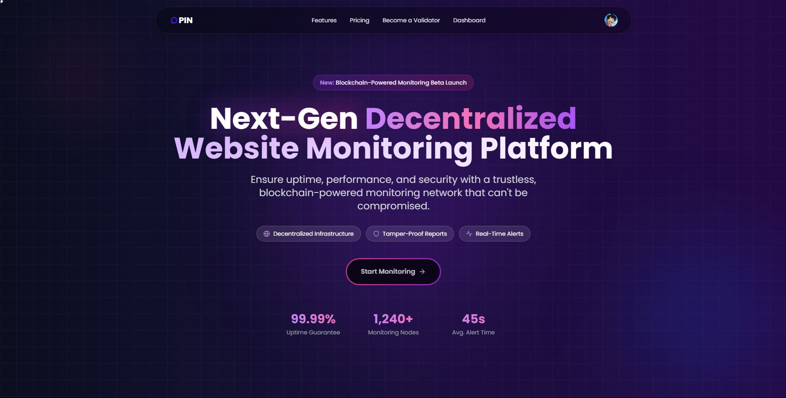
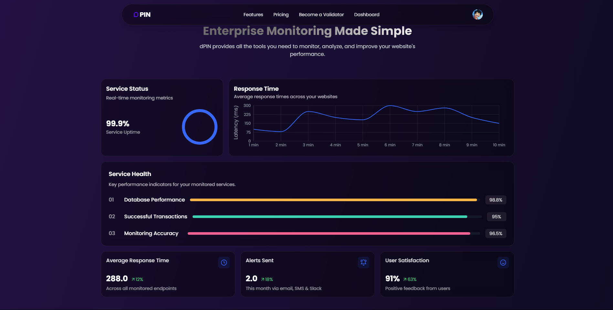
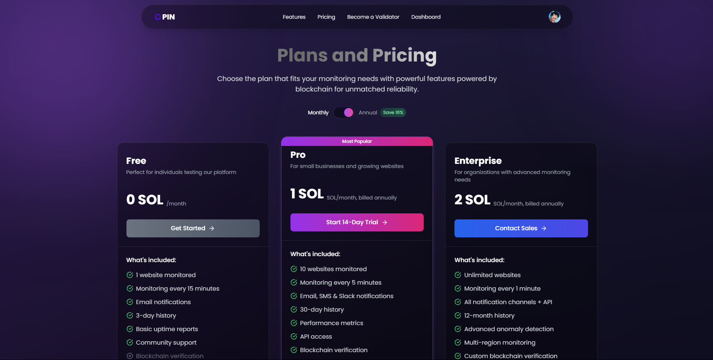
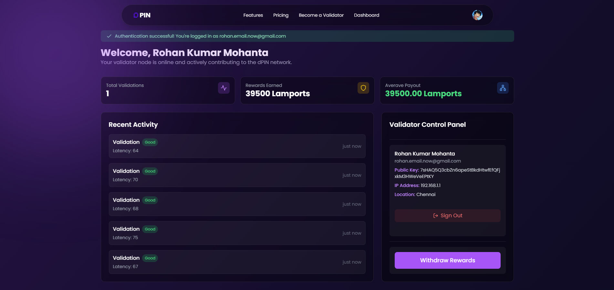
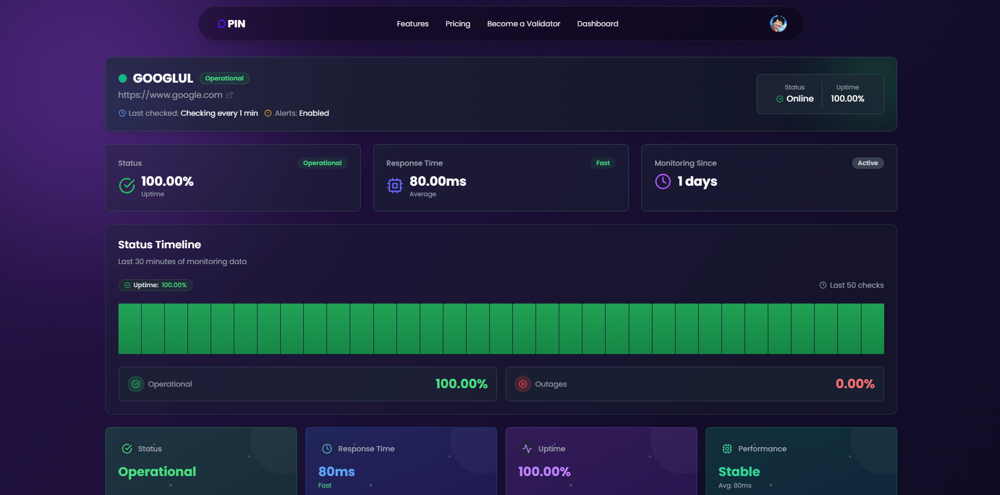
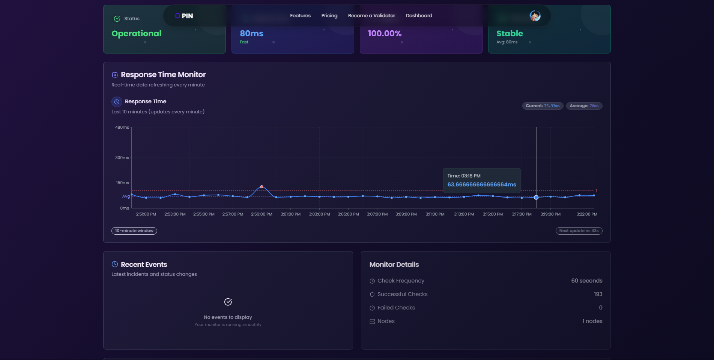
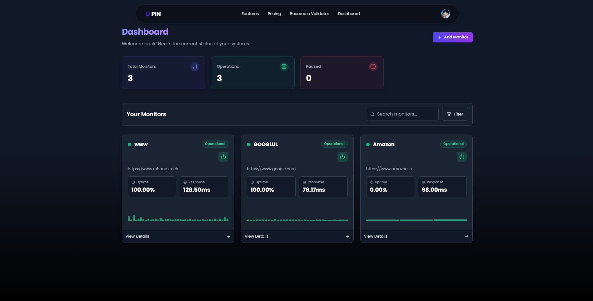
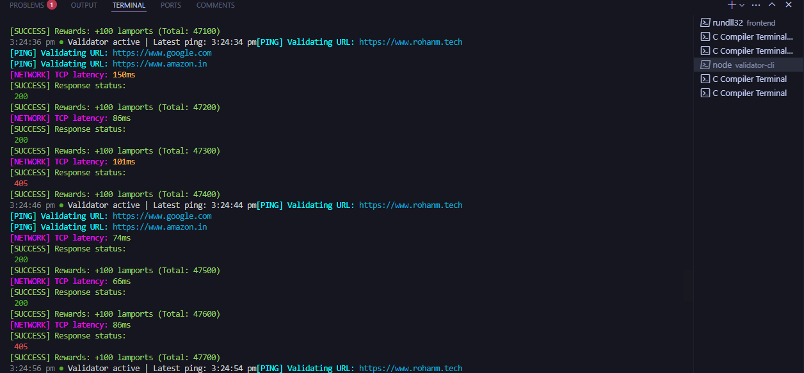
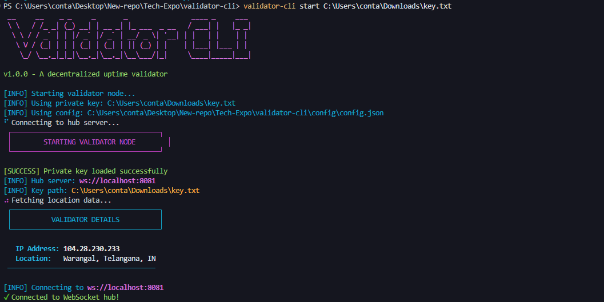
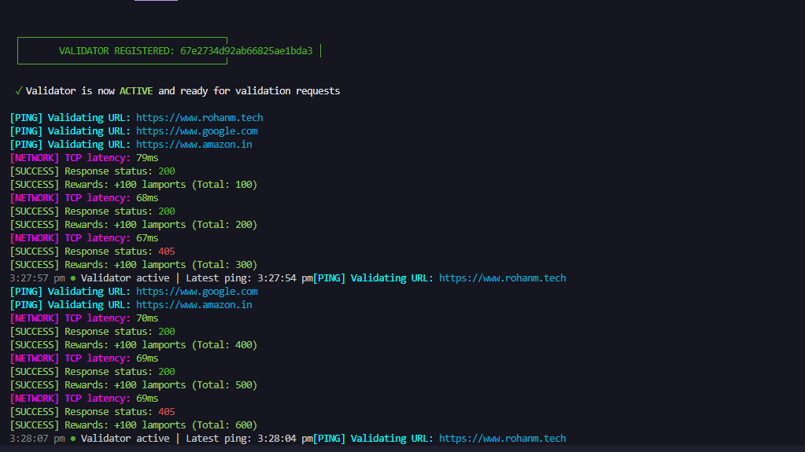

# 🌐 AEGIS Website Monitoring System 

A **decentralized website monitoring system** leveraging **AEGIS (Decentralized Public Infrastructure Network)** to ensure **trustless uptime verification, real-time alerts, and transparency** without relying on centralized authorities.  

> With AEGIS, experience a truly decentralized, transparent, and reliable website monitoring system.
> 

<div align="center">
  
  
  <a href="https://github.com/Lviffy/AEGIS/contributors">
    
  </a>
  
  
</div>

## 📸 Preview Images

<div align="center">
  <table>
    <tr>
      <td></td>
      <td></td>
      <td></td>
      <td></td>
      <td></td>
    </tr>
    <tr>
      <td></td>
      <td></td>
      <td></td>
      <td></td>
      <td></td>
    </tr>
    <tr>
      <td colspan="5" align="center"><em>Preview of the AEGIS Website Monitoring System Interface</em></td>
    </tr>
  </table>
</div>

---

## 🔥 Key Features  
🔹 **No Single Point of Failure** – Distributed monitoring across independent validators.  

🔹 **Trustless Transparency** – Website owners can prove uptime without a central entity.  

🔹 **Crypto Incentives** – Validators earn rewards for monitoring and reporting website health.  

🔹 **Decentralized Monitoring** – Multiple nodes check website status instead of a single company.  

🔹 **Real-Time Alerts** – Instant notifications for downtime or performance issues.  

🔹 **Security & Privacy** – No third-party access to website data.  

---

## 🛑 Problem Statement  
Traditional website monitoring systems are **centralized, opaque, and vulnerable** to **downtime, censorship, and manipulation**. They rely on single providers, limiting transparency and control.  

---

## ✅ Solution  

Our **AEGIS-based monitoring system** decentralizes website uptime tracking by leveraging independent validators across a global network. Unlike traditional systems, which rely on a single authority, our solution ensures **real-time, trustless, and tamper-proof monitoring** without any central points of failure. Website owners can **prove uptime transparently**, while users receive **instant alerts** for downtime or performance issues. Validators are incentivized with **crypto rewards**, fostering a **self-sustaining, censorship-resistant** ecosystem that enhances reliability, security, and trust in website monitoring.

✨ **Website owners** can verify uptime transparently.  

⚡ **Users** receive **instant alerts** for downtime or performance issues.  

💰 **Validators** are rewarded with **crypto incentives**, fostering a **self-sustaining, censorship-resistant** monitoring ecosystem.  

---

## 🛠️ Tech Stack  
🛡️ **Blockchain** – Solana 

🌍 **AEGIS (Decentralized Public Infrastructure Network)** – Distributed monitoring  

🔗 **Database** – MongoDB   

🖥️ **Frontend** – React.js, Radix UI, Tailwind CSS, ShadCN  

📡 **Backend** – Node.js, Express.js

🔒 **Authentication** – Clerk

⚙️ **Validator CLI** – Commander.js, Chalk

---

## ⚙️ Installation & Setup  
```bash
# Clone the repository
git clone https://github.com/Lviffy/AEGIS.git
cd AEGIS

# Install backend dependencies
cd backend
npm install

# Set up environment variables
cp .env.example .env
# Edit .env with your specific configuration

# Run the backend server
node index.js

# Install frontend dependencies
cd ../frontend
npm install

# Set up frontend environment variables
cp .env.example .env
# Edit .env with your Clerk publishable key and other configs

# Run the frontend development server
npm run dev

# Open your browser at http://localhost:5173
```

## 🔑 Getting API Keys

Before you can run the application, you'll need to obtain several API keys and credentials:

### 1. JWT Secret
- This is used for authentication in the backend
- Generate a secure random string:
  ```bash
  openssl rand -base64 32
  ```
  Or simply create a strong password-like string

### 2. Solana Wallet Keys (Admin)
- Generate a Solana keypair for the admin account:
  ```bash
  # Install Solana CLI tools if you haven't already
  solana-keygen new
  ```
  - The output will show your public key and save your private key
  - Use these values for `ADMIN_PUBLIC_KEY` and `ADMIN_PRIVATE_KEY`

### 3. Solana RPC URL
- Sign up for a free account at [Alchemy](https://www.alchemy.com/)
- Create a new Solana app (can use Devnet for testing)
- Copy the HTTP URL from your dashboard
- Format: `https://solana-devnet.g.alchemy.com/v2/YOUR_API_KEY`

### 4. Clerk Authentication
- Create an account at [Clerk](https://clerk.dev/)
- Set up a new application
- From your Clerk dashboard:
  - Get your `CLERK_PUBLISHABLE_KEY` (starts with `pk_test_`)
  - Get your `CLERK_SECRET_KEY` (starts with `sk_test_`)
  - Use the publishable key for both backend and frontend

### 5. Email Service (Nodemailer)
- If using Gmail:
  1. Go to your Google Account → Security
  2. Enable 2-Step Verification if not already enabled
  3. Go to App passwords
  4. Create a new app password
  5. Use this password for `PASS_NODEMAILER`

After obtaining all keys, add them to your `.env` files in both backend and frontend directories.

## 🧠 Project Structure
```
AEGIS/
├── backend/               # Express.js server
│   ├── db/                # Database connection
│   ├── model/             # MongoDB schemas
│   ├── utils/             # Helper functions
│   └── index.js           # Main server file
├── frontend/              # React.js application
│   ├── src/
│   │   ├── components/    # Reusable UI components
│   │   ├── pages/         # Page components
│   │   ├── utils/         # Utility functions
│   │   └── App.jsx        # Main application component
│   └── public/            # Static assets
└── validator-cli/         # CLI tool for validators
    ├── src/               # Source code
    └── utils/             # CLI utilities
```

---

## ℹ️ Additional Information  
🔹 **Minimum Validator Balance** – To become a validator, your crypto wallet must have at least **0.05 SOL**. 

🔹 **Wallet Public Key** – Needed for withdrawal of earned rewards. 

🔹 **Key Generation** – Automatically generates a pair of **public & private keys** for enhanced security.  

🔹 **Decentralized Transactions** – Ensures secure and anonymous payment processing.  

---

## ❓ Troubleshooting  
If you face any issues, try these steps:  

⚠️ **Issue:** App not starting  
🔹 **Solution:** Ensure **Node.js** and **npm** are installed, and run `npm install` before starting the application.  

⚠️ **Issue:** Wallet not connecting  
🔹 **Solution:** Make sure **Phantom** or any compatible Solana wallet is installed and connected to the correct network.  

⚠️ **Issue:** No real-time alerts  
🔹 **Solution:** Check if notifications are **enabled** in browser settings.  

⚠️ **Issue:** Transaction failures  
🔹 **Solution:** Ensure your wallet has **sufficient SOL** for transactions.  

⚠️ **Issue:** Authentication problems  
🔹 **Solution:** Verify your Clerk API keys are correctly configured in your environment variables.

---

## 📝 API Endpoints

### User Endpoints
- `POST /user` - Create a new user
- `GET /dashboard-details` - Get user dashboard information

### Website Monitoring Endpoints
- `POST /website` - Register a new website for monitoring
- `GET /website/:id` - Get details for a specific website
- `DELETE /website/:id` - Remove a website from monitoring
- `PUT /website-track/:id` - Enable/disable monitoring for a website
- `GET /website-details:id` - Get detailed metrics for a website

### Validator Endpoints
- `POST /validator-login` - Authenticate as a validator
- `GET /validator-details` - Get validator activity and rewards information

---

## 🙌 Team Members
- **Rohan Kumar Mohanta**
- **Jayesh Krishna**
- **Shivangi Sharma**

---

## 🤝 Contributing  
We welcome contributions! Follow these steps:  

1️⃣ **Fork** the repo  

2️⃣ **Create** a new branch: `git checkout -b feature-branch`  

3️⃣ **Commit** your changes: `git commit -m "Added new feature"`  

4️⃣ **Push** to the branch: `git push origin feature-branch`  

5️⃣ **Submit** a **Pull Request (PR)**  

💡 **Tip:** Always write **clear commit messages** and follow **best coding practices** before submitting a PR!  

---

## 📜 If you found this useful, don't forget to ⭐ star this repo!
